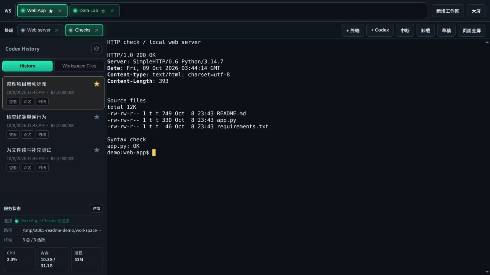
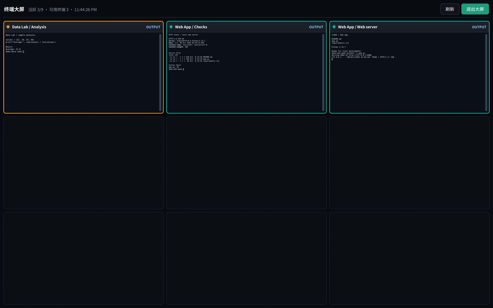
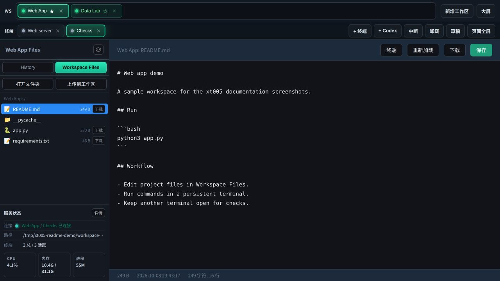
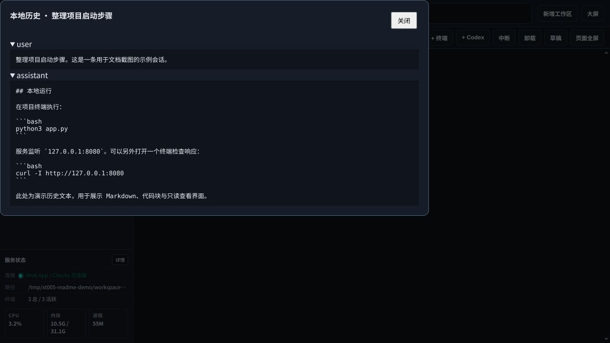

# xt005

**把多个项目的终端、文件和 Codex 历史放进同一个浏览器工作台。**

xt005 是运行在 Linux 上的个人开发工作台。你可以把本机或远程服务器上的项目目录加入工作区，在每个项目里保留多个终端：一个跑开发服务，一个执行测试，另一个运行命令行 coding agent。切换项目或关闭浏览器后，终端进程仍由服务端持有；回来时可以继续连接。

界面以终端为中心，同时提供工作区文件编辑、Codex 本地历史查看、输入草稿，以及跨项目的终端大屏。适合需要在多个项目、多个命令行任务之间来回切换的人。



> 本文截图来自当前版本的真实运行界面。项目目录、终端命令和历史对话使用演示数据；不包含私人会话或账号凭据。

## 你可以怎样使用它

### 一个项目，多个常驻终端

点击「新增工作区」导入已有目录，也可以创建新目录。顶部的工作区支持排序和置顶，每个工作区有自己的终端标签。通过「+ 终端」打开 shell，再次点击当前终端标签可以改名。

例如，在 `Web App` 中用一个终端运行开发服务器，在 `Checks` 终端执行测试和 Git 命令；切到 `Data Lab` 跑分析脚本，再回到原项目查看输出。左下角可以看到连接、目录、终端数量和系统资源信息。

终端支持 ANSI 输出、中文输入、滚动回看和断线重连。已有命令行工具可以直接在 shell 中运行，是否需要登录或 API key 由工具本身决定。

### 用大屏查看多个任务

「大屏」把不同工作区的终端集中到九宫格中，最多同时显示九个终端。点击卡片可聚焦单个终端，并在聚焦视图中切换上一个 / 下一个终端。适合同时盯开发服务、构建输出和长时间运行的任务。



### 就地浏览和修改项目文件

左侧切换到 **Workspace Files**，可以浏览目录、打开文本文件、修改并保存，也可以上传和下载文件。编辑器显示当前路径、大小、修改时间和字符 / 行数，点击「终端」即可回到命令行。

这是一个轻量文本编辑器，适合改配置、脚本和文档。文件预览上限为 10 MiB，更大的文件可下载后处理。「打开文件夹」调用的是服务所在机器的文件管理器。



### 找回 Codex 会话，先查看再继续

**History** 按工作区展示本地 Codex 会话，可以命名、标记重要、归档和查看归档记录。「查看」以只读方式分页读取本地 JSONL，按用户、助手和工具等记录类型展示文本；不需要启动模型，也不会修改原始对话。

点击会话条目可尝试在终端中恢复会话。「+ Codex」则新建一个 Codex 终端。这两个快捷入口要求本机 CLI 支持 `--no-daemon`；不满足时，仍可通过普通终端自行启动已安装的 CLI。模型选择、登录和审批操作在 CLI 内完成。



「草稿」用于提前整理长指令或多行文本，按工作区和会话 / 终端保存在当前浏览器中。点击「粘贴到终端」后原稿仍会保留，便于核对输入再提交。

## 快速开始

需要 **Linux、Python 3.10+、venv 和 Git**。普通终端、文件管理不要求安装 Codex；首次安装 Python 依赖需要网络。

```bash
git clone --branch master --single-branch https://github.com/equationofmathphysics/xt005.git
cd xt005
python3 -m venv .venv
.venv/bin/python -m pip install -r requirements.lock
./run.sh
```

打开 **http://127.0.0.1:51437/**。直接运行时，初始工作区默认为项目目录；可以在页面中加入其他目录。

如需修改监听端口或初始目录，可以复制 `.env.example` 为 `.env` 后编辑，或在启动时传入：

```bash
HOST=127.0.0.1 PORT=51437 DEFAULT_WORKSPACE=/absolute/path/to/project ./run.sh
```

`run.sh` 会继承显式代理设置，否则尝试读取 GNOME 手动代理，最后回退到本机 HTTP `1081` / SOCKS `1080`。终端子进程也会继承这些变量；命令行工具联网异常时请检查代理配置。

### 安装为后台服务

需要可用的 **systemd 用户会话**。在仓库目录执行：

```bash
./install.sh --no-start
systemctl --user start xt005 xt005-rescue
```

安装器创建主服务和独立抢救服务，配置默认保存在 `~/.config/xt005/`，运行状态保存在 `~/.local/state/xt005/`。不带 `--no-start` 运行安装器会直接重启这两个服务。

抢救页默认位于 **http://127.0.0.1:51438/**，使用 `~/.config/xt005/rescue-token` 中的令牌登录。主应用停止或出错时，仍可通过独立页面查看状态与日志、启动 / 停止 / 重启主服务，以及执行 Git 版本更新和回退。更新远端版本时使用 `origin/master`。

完整配置、更新流程与回退说明见 [INSTALL.md](INSTALL.md)。

### 从另一台电脑访问

主服务拥有运行 shell 和读写文件的能力，面向个人可信环境使用。默认只监听本机回环地址；远程服务器推荐通过 SSH 转发访问：

```bash
ssh -N -L 51437:127.0.0.1:51437 user@your-server
```

随后在你的电脑上打开 `http://127.0.0.1:51437/`。如果使用反向代理，需要另外配置认证和访问控制。

## 哪些内容会保留

| 操作 / 数据 | 当前行为 |
| --- | --- |
| 切换项目、切换终端、关闭浏览器 | 后台终端继续运行，可重新连接 |
| 「中断」 | 向当前终端发送 Ctrl-C，结果由终端中的程序决定 |
| 「卸载」或关闭终端 | 结束该终端及其子进程 |
| 停止、重启主服务 | 终端进程结束，内存中的屏幕和滚动缓冲清空；普通 shell 标签可恢复 |
| 工作区、排序、置顶、历史标题与重要标记 | 保存在服务端本地文件中 |
| Codex 原始历史 | 来自本地 Codex 数据目录，网页只读展示 |
| 草稿 | 保存在当前浏览器；不在不同浏览器间同步 |

恢复历史会话会重新运行 CLI 的 resume，不是恢复原终端进程。没有可靠结构化事件时，网页不能判断 agent 是否已经完成任务，需要查看终端输出。当前版本以桌面浏览器为主，移动端交互仍有待完善。

## 开发与项目结构

后端使用 Flask、Flask-SocketIO 和 Linux PTY，Gunicorn 的单个 worker 持有终端进程；前端使用原生 JavaScript 和 xterm.js。部署时保持 **一个 worker**，不要用增加 worker 数的方式扩容终端服务。

```text
frontend/             工作区、终端、大屏、文件和历史界面
src/codexws_server/    PTY 运行时、HTTP / Socket.IO 接口、本地状态
rescue/               独立抢救服务、更新与回退
voice_input/          可选的桌面语音输入模块
tests/                单元、集成及浏览器回归测试
docs/                 接口、架构、交互说明和 UI 截图
```

`voice_input/` 是独立的豆包 / 火山引擎语音输入模块，提供桌面热键录音、转写和粘贴；需要单独安装并配置凭据，详见 [语音输入说明](voice_input/README.md)。

安装开发依赖并运行测试：

```bash
.venv/bin/python -m pip install -r requirements-dev.txt
PYTHONPATH="$PWD/src:$PWD" .venv/bin/python -m unittest discover -v
```

浏览器用例还需要 Node.js、Playwright 和 Chromium；缺少时相关测试会跳过。生成源码发布包：

```bash
./build-source-package.sh
```

更多说明：[安装与恢复](INSTALL.md) · [HTTP / Socket.IO API](docs/api/README.md) · [交互和数据边界](docs/interaction-model.md) · [架构与迁移记录](docs/architecture-proposal.md) · [开发计划](TODO.md)

## 许可证

本项目使用 [WH Covenant Public License 1.0](LICENSE)，与 [longtail](https://github.com/equationofmathphysics/longtail) 使用相同许可证。第三方前端库的许可证保留在 `frontend/assets/vendor/` 和 `.cdnlocal/` 中。
